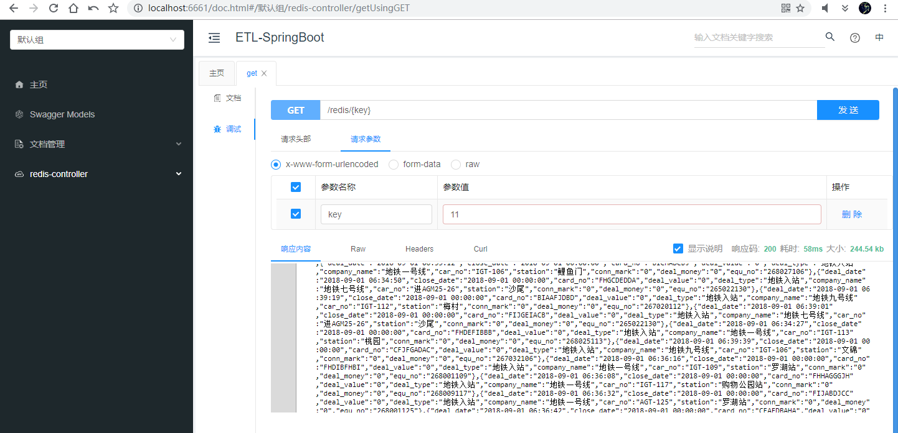

# SZT-bigdata 深圳地铁大数据客流分析系统 🚇🚇🚇

```
   ___     ____   _____           _         _      __ _      _             _
  / __|   |_  /  |_   _|   ___   | |__     (_)    / _` |  __| |   __ _    | |_    __ _
  \__ \    / /     | |    |___|  | '_ \    | |    \__, | / _` |  / _` |   |  _|  / _` |
  |___/   /___|   _|_|_   _____  |_.__/   _|_|_   |___/  \__,_|  \__,_|   _\__|  \__,_|
_|"""""|_|"""""|_|"""""|_|     |_|"""""|_|"""""|_|"""""|_|"""""|_|"""""|_|"""""|_|"""""|
"`-0-0-'"`-0-0-'"`-0-0-'"`-0-0-'"`-0-0-'"`-0-0-'"`-0-0-'"`-0-0-'"`-0-0-'"`-0-0-'"`-0-0-'
```

## 项目说明🚩：
- 🎈该项目主要分析深圳通刷卡数据，通过大数据技术角度来研究深圳地铁客运能力。
- ✨🎉 强调学以致用，本项目的原则是尽可能使用较多的常用技术框架，加深对各技术栈的理解和运用，在使用过程中体验各框架的差异和优劣，为以后的开发项目选型做基础。
- 👑 解决同一个问题，可能有多种技术实现；实际的企业开发应当遵守最佳实践原则。


## 数据源🌍：
- 深圳市政府数据开放平台，深圳通刷卡数据 133.7 万条【离线数据】，
https://opendata.sz.gov.cn/data/api/toApiDetails/29200_00403601
    
理论上可以当作实时数据，但是这个接口响应太慢了，于是本项目采用离线思路处理。当然，如果采用 kafka 队列方式，也可以模拟出实时效果。
    
## 核心技术栈⚡：
- flink
- redis
- SpringBoot
- knife4j （前身为 swagger-bootstrap-ui）
- 

## 快速开始🛩🥇：
1- 获取数据源的 appKey：https://opendata.sz.gov.cn/data/api/toApiDetails/29200_00403601

2- 调用 ETL-SpringBoot 模块获取原始数据存盘，`cn/java666/etlspringboot/source/SZTData.saveData()`；

3- 调用 ETL-Flink 模块，实现 etl 清洗，去除重复数据，redis 天然去重排序，保证数据干净有序，`cn.java666.etlflink.sink.MyRedisSink.main()`。

4- redis 查询，redis-cli 登录:  
`> hget szt:pageJson 1`  

或者 dbeaver 可视化查询：


5- `cn.java666.etlspringboot.EtlSApp.main()` 启动后，也可以用 knife4j 在线调试 REST API：
   

   

## 更新日志🌥：
- 2020-04-13 
    - 项目初始化；
    - 完成数据源清洗去重，存到 redis；
    - 完成 redis 查询 REST API 的开发；
    
